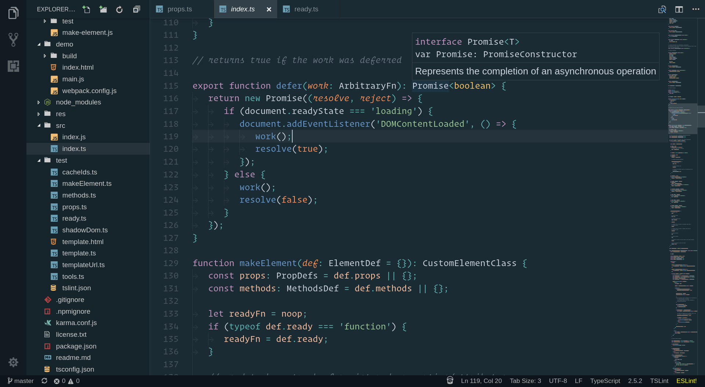
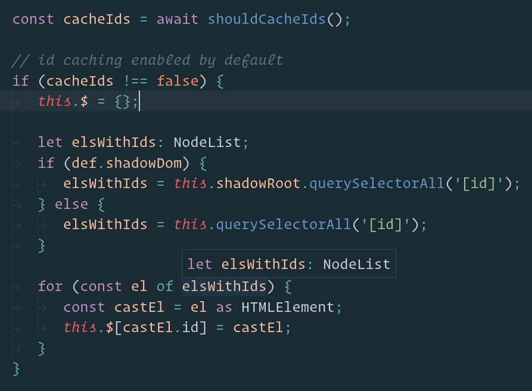

# Oceanic Plus

Oceanic Plus is a color scheme based on the popular Oceanic Next, with enhanced VSCode-specific enhancements targeting the workspace and other UI elements

## Credits

- [Oceanic Next Color Scheme](https://github.com/voronianski/oceanic-next-color-scheme)
- [Oceanic Next Italic](https://github.com/Bloemert/oceanic-next-italic)
